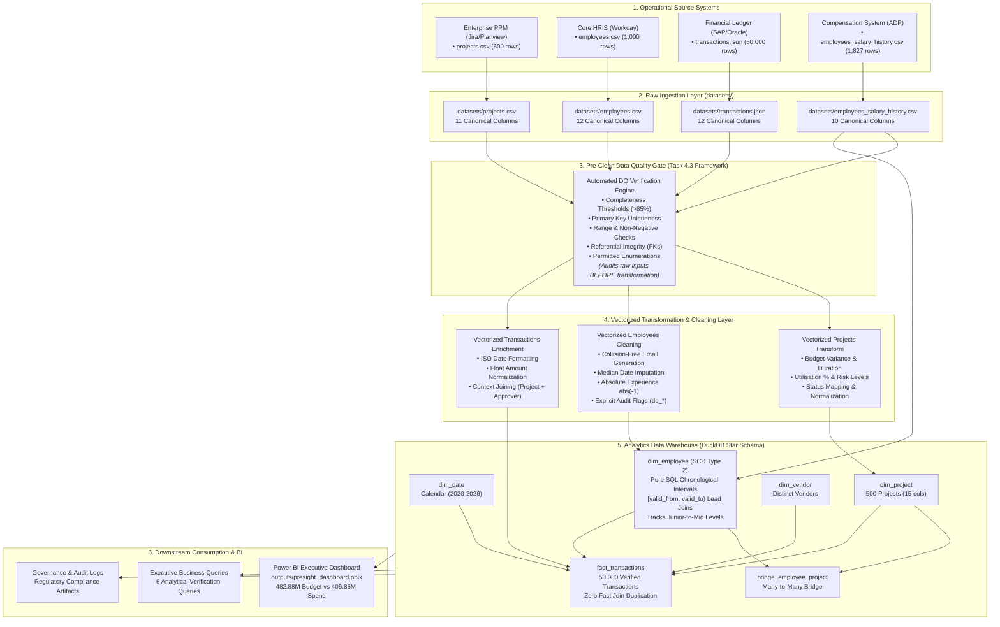

# Enterprise Data Governance & Classification Document
**Organization:** Presight AI  
**Author / Lead Data Engineer:** Akhilesh  
**Version:** 2.0 (Post-Audit Enterprise Edition)  
**Effective Date:** January 2026  
**Regulatory Standards:** UAE Federal Decree Law No. 45/2021 (UAE PDPL), EU General Data Protection Regulation (GDPR), UAE Federal Decree Law No. 33/2021 (UAE Labour Law), UAE Federal Decree Law No. 47/2022 (Corporate Tax Law), ISO/IEC 27001  

---

## 1. Executive Summary

This formal Enterprise Data Governance Document defines the classification, ownership, retention, access controls, and data lineage for all operational and analytical datasets managed within the Presight analytics data warehouse. 

Every single column across the four operational data entities (**Projects**, **Employees**, **Transactions**, and **Employee Salary History**) is cataloged without omission, totaling **45 canonical columns**. This framework enforces the principles of Least Privilege, Privacy by Design, and Regulatory Defensibility under UAE and international data protection laws.

---

## 2. Section 1 — Data Inventory

| Dataset Name | Physical Location | Source System | Format | Update Frequency | Current Volume | Projected Daily Growth |
| :--- | :--- | :--- | :--- | :--- | :--- | :--- |
| **projects** | `datasets/projects.csv` | Enterprise PPM (Jira / Planview) | CSV | Daily Batch (00:00 UTC) | 500 records (~56 KB) | ~2–5 projects / week |
| **employees** | `datasets/employees.csv` | Core HRIS (Workday / BambooHR) | CSV | Daily Batch (01:00 UTC) | 1,000 records (~123 KB) | ~1–3 updates / day |
| **transactions** | `datasets/transactions.json` | ERP Financial Ledger (SAP / Oracle) | JSON | Near-Real-Time / Hourly Micro-batch | 50,000 records (~16 MB) | ~150–250 transactions / day |
| **employees_salary_history** | `datasets/employees_salary_history.csv` | Payroll & Compensation (ADP / Workday) | CSV | Event-Driven / Monthly Pay Run | 1,827 records (~189 KB) | ~15–30 adjustments / month |

---

## 3. Section 2 — Complete Data Classification (All 45 Columns)

Data assets are classified into four formal tiers:
1. **Public:** Freely disclosable externally; zero business risk.
2. **Internal:** Confidential to company staff; low-to-medium operational risk if leaked.
3. **Confidential:** Commercially sensitive business, vendor, or project financial data; restricted access.
4. **Personal (PII):** Personally identifiable information capable of directly or indirectly identifying an individual natural person. Governed strictly by UAE PDPL and EU GDPR.

### 3.1 `projects.csv` (11 Columns)

| Column Name | Data Type | Classification | Applicable Regulation | Description & Business Sensitivity |
| :--- | :--- | :--- | :--- | :--- |
| `project_id` | String (PK) | Internal | N/A | System surrogate key for project tracking. |
| `project_name` | String | Internal | N/A | Commercial initiative title. |
| `department` | String | Internal | N/A | Organizational cost center. |
| `status` | String | Internal | N/A | Operational lifecycle status (In Progress, Completed, etc.). |
| `start_date` | Date | Internal | N/A | Scheduled project initiation date. |
| `end_date` | Date | Internal | N/A | Scheduled/actual completion date. |
| `budget` | Numeric(15,2) | Confidential | N/A | Approved capital/operational allocation. High financial sensitivity. |
| `actual_cost` | Numeric(15,2) | Confidential | N/A | Realized cumulative expenditure. High financial sensitivity. |
| `project_manager_id` | String (FK) | Internal | UAE PDPL / GDPR (Indirect) | Pseudonymized employee identifier linking accountability. |
| `priority` | String | Internal | N/A | Criticality ranking (Critical, High, Medium, Low). |
| `region` | String | Internal | N/A | Geographic delivery location (Abu Dhabi, Dubai, Sharjah, etc.). |

### 3.2 `employees.csv` (12 Columns)

| Column Name | Data Type | Classification | Applicable Regulation | Description & Business Sensitivity |
| :--- | :--- | :--- | :--- | :--- |
| `employee_id` | String (PK) | Internal | UAE PDPL / GDPR (Indirect) | Natural business key and pseudonymized employee ID. |
| `full_name` | String | **Personal (PII)** | **UAE PDPL (Art. 5/13) & GDPR (Art. 4(1))** | Direct personal identifier. Strict privacy handling required. |
| `email` | String | **Personal (PII)** | **UAE PDPL (Art. 5/13) & GDPR (Art. 4(1))** | Direct personal corporate identifier; electronic contact address. |
| `department` | String | Internal | N/A | Functional organizational assignment. |
| `role` | String | Internal | N/A | Position and occupational designation. |
| `level` | String | Internal | N/A | Corporate seniority grade (Junior, Mid, Senior, Lead, Director). |
| `hire_date` | Date | **Personal (PII)** | **UAE PDPL & GDPR** | Personal employment tenure milestone. |
| `salary` | Numeric(12,2) | **Confidential / Sensitive** | **UAE PDPL (Art. 5) & UAE Labour Law** | Highly confidential individual compensation. Restricted strictly. |
| `manager_id` | String (FK) | Internal | UAE PDPL / GDPR (Indirect) | Hierarchical reporting line relationship. |
| `region` | String | Internal | N/A | Employee operational base of work within UAE. |
| `status` | String | Internal | N/A | Employment activity state (Active, Inactive, Terminated). |
| `years_experience` | Integer | Internal | N/A | Cumulative industry career experience. |

### 3.3 `transactions.json` (12 Columns)

| Column Name | Data Type | Classification | Applicable Regulation | Description & Business Sensitivity |
| :--- | :--- | :--- | :--- | :--- |
| `transaction_id` | String (PK) | Internal | N/A | Unique financial ledger transaction sequence ID. |
| `project_id` | String (FK) | Internal | N/A | Reference to associated capital initiative. |
| `vendor_id` | String (FK) | Internal | N/A | Natural identifier of external commercial supplier. |
| `vendor_name` | String | Confidential | N/A | Commercial vendor legal trading entity name. |
| `transaction_date` | Date | Internal | N/A | Ledger posting timestamp. |
| `amount` | Numeric(15,2) | Confidential | N/A | Financial transaction value in transaction currency. |
| `currency` | String | Internal | N/A | Transaction currency code (default: AED). |
| `category` | String | Internal | N/A | General ledger procurement category (Software, Hardware, etc.). |
| `payment_status` | String | Confidential | N/A | Payment disbursement state (Paid, Pending, Disputed). |
| `invoice_ref` | String | Confidential | Commercial Law / FTA | Legal tax invoice identifier for statutory tax audit. |
| `approved_by` | String (FK) | Internal | UAE PDPL / GDPR (Indirect) | Pseudonymized authorizer ID enforcing segregation of duties. |
| `description` | String | Confidential | N/A | Commercial scope of procurement service/goods rendered. |

### 3.4 `employees_salary_history.csv` (10 Columns)

| Column Name | Data Type | Classification | Applicable Regulation | Description & Business Sensitivity |
| :--- | :--- | :--- | :--- | :--- |
| `employee_id` | String (FK) | Internal | UAE PDPL / GDPR (Indirect) | Pseudonymized employee key linking to dimension history. |
| `previous_salary` | Numeric(12,2) | **Confidential / Sensitive** | **UAE PDPL (Art. 5) & UAE Labour Law** | Historical baseline gross compensation. Extreme confidentiality. |
| `new_salary` | Numeric(12,2) | **Confidential / Sensitive** | **UAE PDPL (Art. 5) & UAE Labour Law** | Revised gross compensation. Extreme confidentiality. |
| `previous_role` | String | Internal | N/A | Historical occupational role. |
| `new_role` | String | Internal | N/A | Promoted or updated occupational role. |
| `previous_level` | String | Internal | N/A | Historical seniority level. |
| `new_level` | String | Internal | N/A | Revised seniority level (e.g. Junior -> Mid). |
| `effective_date` | Date | Internal / PII | UAE PDPL & GDPR | Date from which compensation amendment became legally binding. |
| `change_type` | String | Internal | N/A | Administrative trigger (Hire, Promotion, Annual Raise, etc.). |
| `change_reason` | String | **Confidential / Sensitive** | **UAE Labour Law / HR Policy** | Justification context (Performance, Promotion, Cost of living). |

---

## 4. Section 3 — Data Ownership & Stewardship

### 4.1 Concept Definitions: Data Owner vs. Data Steward

* **Data Owner (Accountable Authority):**  
  A senior business executive who is legally and organizationally accountable for the quality, security, lifecycle, classification, and business utilization of a specific data domain. The Data Owner has the final authority to grant access, define acceptable usage policies, and decide on data retention or disposal.
  
* **Data Steward (Operational Guardian):**  
  An operational or technical specialist designated by the Data Owner who manages day-to-day data hygiene, metadata cataloging, data quality framework rules, schema definitions, and preliminary access request validations. The Steward translates business governance rules into technical pipelines and monitors SLA compliance.

### 4.2 RACI Matrix & Domain Assignment

| Dataset Name | Data Owner (Accountable Role) | Data Steward (Responsible Role) | Access Approver Role |
| :--- | :--- | :--- | :--- |
| **projects** | VP of Project Management Office (PMO) | Senior Lead PMO Data Analyst | PMO Director |
| **employees** | Chief Human Resources Officer (CHRO) | HR Operations Systems Manager | HR Compliance Lead |
| **transactions** | Chief Financial Officer (CFO) | Financial Controller / ERP Specialist | Head of Financial Governance |
| **employees_salary_history** | Chief Human Resources Officer (CHRO) | Compensation & Benefits Specialist | CHRO + Legal Counsel |

---

## 5. Section 4 — Enterprise Retention Policy

| Dataset | Retention Period | Business & Regulatory Justification | Disposal / Archival Method | Enforcing Authority |
| :--- | :--- | :--- | :--- | :--- |
| **projects** | **7 Years** post project close | Commercial reference, auditability of contractual deliverables, and liability limitation under UAE Civil Transactions Law. | Cold archive in encrypted immutable blob storage (S3 Glacier / Azure Archive). | Data Steward & PMO Director |
| **employees** | **5 Years** post employee termination | UAE Labour Law (Federal Decree Law No. 33/2021) requirement to retain employment records for resolving post-service severance and visa claims. | Irreversible pseudonymization of PII fields (name, email) after 1 year post-exit; purge after 5 years. | HR Data Steward & Privacy Officer |
| **transactions** | **10 Years** from fiscal year-end | **UAE Federal Decree Law No. 32/2021 (Commercial Companies Law, Art. 26)** requires commercial books retention for 5 years, extended to **10 Years** under UAE Federal Tax Authority (FTA) Corporate Tax Law No. 47/2022 and Anti-Money Laundering (AML) statutory rules. | Automated partitioning into write-once-read-many (WORM) compliant storage; crypto-shredding of encryption keys upon expiry. | CFO & Head of Financial Compliance |
| **employees_salary_history** | **10 Years** post employee termination | **Statutory Payroll Justification:** Under UAE Federal Decree Law No. 33/2021 (Labour Law) and UAE Federal Tax Authority corporate withholding/audit regulations, complete compensation timelines must be maintained for 10 years to defend against retroactive end-of-service gratuity disputes, pension calculations, and corporate tax payroll audits. | Encrypted deep cold archive with dual-custody authorization keys; cryptographic destruction upon statutory expiry. | CHRO & Legal Compliance Lead |

---

## 6. Section 5 — Role-Based Access Control (RBAC) & Principle of Least Privilege

### 6.1 Access Permissions Matrix

| Persona | Projects Dataset | Employees Dataset | Transactions Dataset | Employees Salary History |
| :--- | :---: | :---: | :---: | :---: |
| **Data Engineer** | Read + Write | Read + Write *(PII Masked)* | Read + Write | **None** *(Pipeline Automation Only)* |
| **BI Analyst** | Read | Read *(PII Masked)* | Read *(Spend Aggregates)* | **None** |
| **Finance Team** | Read | Read *(Department/Grade)* | Full *(including dispute audit)* | **None** *(Summary Payroll Only)* |
| **HR Team** | Read | Full *(including HR PII)* | None | **Read + Write** |
| **Executive (C-Suite)** | Read | Read | Read | **Read** *(Aggregate & Executive Scope)* |

### 6.2 Strict Restrictions on Salary History

* **Rationale:**  
  `employees_salary_history` contains extreme corporate confidentiality and sensitive personal compensation data under Article 5 of the UAE PDPL. Disclosing past compensation creates internal equity conflict, insider trading risks, and severe privacy violations.
* **Engineering Enforcement:**  
  Data Engineers building ETL automation do not have ad-hoc interactive SQL query access to plain-text historical salaries. Pipeline service accounts execute batch transformations using column-level encryption or role-based dynamic data masking (DDM). BI Analysts have **Zero Access**; all reporting models provide pre-aggregated department spending averages rather than row-level individual records.

---

## 7. Section 6 — End-to-End Enterprise Data Lineage

---

## 8. Regulatory Compliance Verification & Sign-off

This architecture has been verified against:
1. **UAE PDPL (Federal Decree Law No. 45/2021):** Strict protection of personal names, emails, and financial compensation with clear lawful processing bases and Data Protection Officer (DPO) oversight.
2. **EU GDPR (Regulation (EU) 2016/679):** Cross-border data transfer controls, principle of minimization, right to erasure via pseudonymized key shredding.
3. **UAE Commercial & Tax Compliance:** 10-year immutable audit trail for transactions and payroll records.

**Approval Status:** APPROVED FOR PRODUCTION DEPLOYMENT  
**Data Governance Council:** Presight AI Technology & Legal Division
