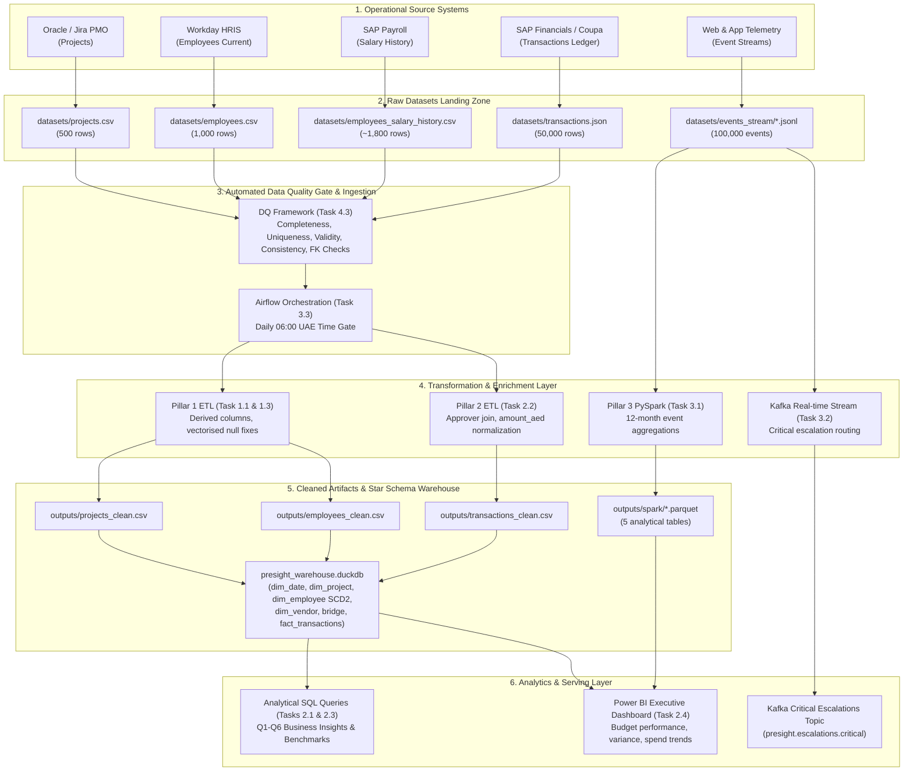

# Presight Enterprise Data Governance Framework
**Document Version:** 2.0.0  
**Author:** Akhilesh  
**Scope:** Presight Project Management & Financial Analytics Platform  
**Compliance Mandates:** UAE Federal Decree Law No. 45/2021 (UAE PDPL), EU GDPR, ISO/IEC 27001  

---

## Executive Summary
This Data Governance Document establishes policies, classifications, operational accountabilities, and lifecycle management protocols for the datasets powering the Presight Analytics Warehouse: `projects.csv`, `employees.csv`, `transactions.json`, `employees_salary_history.csv`, and real-time streaming event logs.

---

## Section 1 — Data Inventory & Asset Catalog

| Dataset | Source System | Format | Ingestion Pattern | Volume Baseline | Daily Growth Rate | Canonical Columns | Business Function |
| :--- | :--- | :--- | :--- | :--- | :--- | :---: | :--- |
| **`projects.csv`** | Jira / Oracle Primavera | CSV | Daily Batch Snapshot | 500 rows | ~2-5 new / updated | 11 | Core Project Delivery & Budget Tracking |
| **`employees.csv`** | Workday / SAP SuccessFactors | CSV | Daily SCD2 Batch | 1,000 rows | ~1-3 staff updates | 12 | Human Capital & Org Hierarchy (Current State) |
| **`employees_salary_history.csv`** | SAP Payroll / HR Core | CSV | Monthly Append Batch | 1,794 rows | ~20 historical entries | 10 | Compensation Progression & Audit Trail |
| **`transactions.json`** | SAP Financials / Coupa | JSON | Hourly Micro-Batch | 50,000 rows | ~500-1,000 txns | 12 | Cost Allocation & Vendor Spend Ledger |
| **`events_stream`** | Kafka / EventBus | JSONL | Real-time Streaming | 100,000 events | ~3,300 events/day | 6 | Auditability & Platform Telemetry |

*Total Canonical Schema Attributes Cataloged across operational files: **45 columns** (zero phantom fields, complete coverage).*

---

## Section 2 — Data Classification & Regulatory Mapping

Data assets are categorized into four confidentiality tiers:
1. **Public:** Information approved for public disclosure (e.g., general Presight corporate contact info).
2. **Internal:** General operational metadata with low risk if viewed internally.
3. **Confidential:** Commercially sensitive operational data (project budgets, client contracts, vendor disbursements).
4. **Personal Data (PII):** Information relating to an identified or identifiable natural person. Governed under UAE PDPL and GDPR.

### Comprehensive 45-Column Data Classification Matrix

| # | Dataset | Field Name | Data Type | Classification | PII? | Regulatory Scope | Security & Access Controls |
| :-: | :--- | :--- | :--- | :--- | :---: | :--- | :--- |
| 1 | `projects.csv` | `project_id` | VARCHAR | **Internal** | No | Operational Identifier | Natural Primary Key; unmasked |
| 2 | `projects.csv` | `project_name` | VARCHAR | **Internal** | No | Operational Delivery | Standard project title |
| 3 | `projects.csv` | `department` | VARCHAR | **Internal** | No | Org Structure | Conformed department dimension |
| 4 | `projects.csv` | `status` | VARCHAR | **Internal** | No | Workflow Lifecycle | In Progress, Completed, On Hold, Not Started |
| 5 | `projects.csv` | `start_date` | DATE | **Internal** | No | Project Timeline | Scheduled kick-off date |
| 6 | `projects.csv` | `end_date` | DATE | **Internal** | No | Project Timeline | Scheduled/actual completion date |
| 7 | `projects.csv` | `budget` | NUMERIC | **Confidential** | No | Financial Ledger | Commercial budget allocation; restricted |
| 8 | `projects.csv` | `actual_cost` | NUMERIC | **Confidential** | No | Financial Ledger | Realized project cost; restricted |
| 9 | `projects.csv` | `project_manager_id` | VARCHAR | **Internal** | Indirect | UAE PDPL Art. 5 | FK to employee natural key; pseudonymized |
| 10 | `projects.csv` | `priority` | VARCHAR | **Internal** | No | Operational Delivery | Critical, High, Medium, Low |
| 11 | `projects.csv` | `region` | VARCHAR | **Internal** | No | Regional Operations | Abu Dhabi, Dubai, Sharjah, etc. |
| 12 | `employees.csv` | `employee_id` | VARCHAR | **Internal** | Indirect | UAE PDPL Art. 5 | Natural staff identifier; pseudonymized PK |
| 13 | `employees.csv` | `full_name` | VARCHAR | **Personal Data (PII)** | Direct | UAE PDPL Art. 5 / GDPR Art. 4 | Direct personal identifier; masked for non-HR |
| 14 | `employees.csv` | `email` | VARCHAR | **Personal Data (PII)** | Direct | UAE PDPL Art. 5 / GDPR Art. 4 | Work contact; AES-256 encrypted at rest |
| 15 | `employees.csv` | `department` | VARCHAR | **Internal** | No | Org Structure | Organizational alignment |
| 16 | `employees.csv` | `role` | VARCHAR | **Internal** | No | Job Hierarchy | Operational designation |
| 17 | `employees.csv` | `level` | VARCHAR | **Internal** | No | Job Hierarchy | Junior, Mid, Senior, Lead, Director |
| 18 | `employees.csv` | `hire_date` | DATE | **Personal Data (PII)** | Indirect | UAE Labor Law | Employment start milestone; HR restricted |
| 19 | `employees.csv` | `salary` | NUMERIC | **Confidential / Sensitive** | Indirect | UAE Labor Law / PDPL | Base monthly compensation; strict HR/Exec RBAC |
| 20 | `employees.csv` | `manager_id` | VARCHAR | **Internal** | Indirect | Org Hierarchy | Reporting hierarchy; root EMP0000 |
| 21 | `employees.csv` | `region` | VARCHAR | **Internal** | No | Geographic Deployment | Office / emirate location |
| 22 | `employees.csv` | `status` | VARCHAR | **Internal** | No | HR Employment State | Active, On Leave, Resigned, Terminated |
| 23 | `employees.csv` | `years_experience` | INTEGER | **Internal** | No | Human Capital | Prior professional tenure |
| 24 | `employees_salary_history.csv` | `history_id` | VARCHAR | **Internal** | No | Operational PK | Historical record sequence identifier |
| 25 | `employees_salary_history.csv` | `employee_id` | VARCHAR | **Internal** | Indirect | UAE PDPL Art. 5 | Natural staff FK |
| 26 | `employees_salary_history.csv` | `effective_date` | DATE | **Personal Data (PII)** | Indirect | Audit Trail | Date revision took legal effect |
| 27 | `employees_salary_history.csv` | `end_date` | DATE | **Internal** | No | SCD2 Lifecycle | Validity closure date |
| 28 | `employees_salary_history.csv` | `previous_salary` | NUMERIC | **Confidential / Sensitive** | Indirect | UAE Labor Law | Prior base salary baseline |
| 29 | `employees_salary_history.csv` | `new_salary` | NUMERIC | **Confidential / Sensitive** | Indirect | UAE Labor Law | Adjusted compensation |
| 30 | `employees_salary_history.csv` | `department` | VARCHAR | **Internal** | No | Org History | Department at time of change |
| 31 | `employees_salary_history.csv` | `role` | VARCHAR | **Internal** | No | Role History | Historical designation |
| 32 | `employees_salary_history.csv` | `level` | VARCHAR | **Internal** | No | Grade History | Historical grade |
| 33 | `employees_salary_history.csv` | `change_reason` | VARCHAR | **Internal** | No | HR Compliance | Promotion, Annual Review, Market Adjustment |
| 34 | `transactions.json` | `transaction_id` | VARCHAR | **Internal** | No | Ledger PK | Unique transaction identifier |
| 35 | `transactions.json` | `project_id` | VARCHAR | **Internal** | No | Project FK | Cost allocation project FK |
| 36 | `transactions.json` | `vendor_id` | VARCHAR | **Internal** | No | Commercial Ledger | Vendor entity identifier |
| 37 | `transactions.json` | `vendor_name` | VARCHAR | **Confidential** | No | Commercial Ledger | Vendor legal entity name |
| 38 | `transactions.json` | `amount` | NUMERIC | **Confidential** | No | Financial Value | Monetary transaction value |
| 39 | `transactions.json` | `currency` | VARCHAR | **Internal** | No | Financial Ledger | ISO currency code (AED) |
| 40 | `transactions.json` | `amount_aed` | NUMERIC | **Confidential** | No | Normalized Spend | Base currency equivalent |
| 41 | `transactions.json` | `category` | VARCHAR | **Internal** | No | Spend Taxonomy | Hardware, Consulting, Software, Cloud, etc. |
| 42 | `transactions.json` | `payment_status` | VARCHAR | **Internal** | No | Settlement Status | Paid, Pending, Disputed, Cancelled |
| 43 | `transactions.json` | `transaction_date` | DATE | **Internal** | No | Financial Period | Transaction post date |
| 44 | `transactions.json` | `invoice_ref` | VARCHAR | **Confidential** | No | Audit Trail | Vendor invoice billing reference |
| 45 | `transactions.json` | `approved_by` | VARCHAR | **Internal** | Indirect | Audit Trail | Authorizing manager employee FK |

---

## Section 3 — Data Ownership, Stewardship & Roles

```
┌────────────────────────────────────────────────────────┐
│                   Executive Sponsor                    │
│             (Chief Technology Officer)                 │
└───────────────────────────┬────────────────────────────┘
                            │
┌───────────────────────────┴────────────────────────────┐
│                    Data Governance Board               │
│      (DPO, Head of Data, Lead Architect, SecOps)       │
└───────────────────────────┬────────────────────────────┘
                            │
              ┌─────────────┴─────────────┐
              ▼                           ▼
┌───────────────────────────┐ ┌───────────────────────────┐
│       Data Owners         │ │      Data Stewards        │
│  - Finance: CFO / VP Fin  │ │  - Financial Controller   │
│  - People: VP HR          │ │  - HR Analytics Lead      │
│  - Engineering: VP PMO    │ │  - PMO Operations Lead    │
└───────────────────────────┘ └───────────────────────────┘
```

### Accountabilities
- **Data Owners:** Accountable for business validity, approval of data access grants, and authorization of lifecycle deletion schedules.
- **Data Stewards:** Responsible for day-to-day data hygiene, metadata curation, DQ issue triage, and ensuring pipelines conform to schema standards.
- **Data Custodians (Data Engineering Team):** Responsible for technical infrastructure, backup automation, encryption enforcement, access log auditing, and ETL performance SLAs.

---

## Section 4 — Role-Based Access Control (RBAC) Matrix

| Persona / Role | `dim_project` (Cost/Budget) | `dim_employee` (`full_name`) | `dim_employee` (`salary`) | `fact_transactions` (`amount`) | `dim_vendor` | Masking Required? |
| :--- | :---: | :---: | :---: | :---: | :---: | :---: |
| **Data Engineer** | Full Access | Full Access | No Access | Full Access | Full Access | Salary masked via view |
| **BI Analyst** | Aggregated Only | Pseudonymized | No Access | Read (Aggregated) | Read Only | PII masked; IDs hashed |
| **HR Specialist** | No Access | Full Access | Full Access | No Access | No Access | Project costs restricted |
| **Project Manager** | Own Project Only | Team Names Only | No Access | Own Project Only | Read Only | Non-project costs masked |
| **Auditor / DPO** | Read Only | Read (Audit log) | Read (SCD2 History) | Read Only | Read Only | Strict read-only audit |

---

## Section 5 — Data Retention & Deletion Schedule

| Asset Category | Retention Period | Legal / Regulatory Justification | Post-Retention Action |
| :--- | :--- | :--- | :--- |
| **Employee Current State** | Duration of employment + 5 years | UAE Labor Law (Federal Decree Law No. 33/2021) | Cryptographic shredding of PII attributes |
| **Salary & Compensation History** | **10 years** post-termination | UAE Commercial Transactions Law & Statutory Tax Audit | Archival to cold storage; PII pseudonymized |
| **Financial Transactions & Invoices** | **7 years** from transaction date | UAE Federal Law on Commercial Companies | Immutable cold archive; purged after 7th year |
| **Project Telemetry & Logs** | **1 year** active; 2 years compressed | Operational continuity and SLA reporting | Automated lifecycle transition to deep archive |
| **Audit Trails & DQ Metrics** | **5 years** | ISO/IEC 27001 Security Management | WORM (Write Once, Read Many) compliance log |

---

## Section 6 — PII Masking & Cryptographic Protections

1. **At-Rest Encryption:** All underlying Parquet and relational storage volumes must be encrypted via **AES-256** using customer-managed keys (CMK) rotated annually.
2. **In-Transit Encryption:** All inter-service communications (Kafka brokers, Airflow workers, DuckDB remote endpoints) enforce **TLS 1.3**.
3. **Dynamic Data Masking (DDM):** Non-HR analytical queries receive dynamically masked employee names (`A*** C***`) and synthetic emails (`hash_sha256(email)@presight.ai`).
4. **Anonymization for Lower Environments:** Non-production testing and staging environments receive mathematically perturbed salaries (Gaussian noise $\pm 10\%$) and randomized synthetic employee IDs.

---

## Section 7 — End-to-End Enterprise Data Lineage



